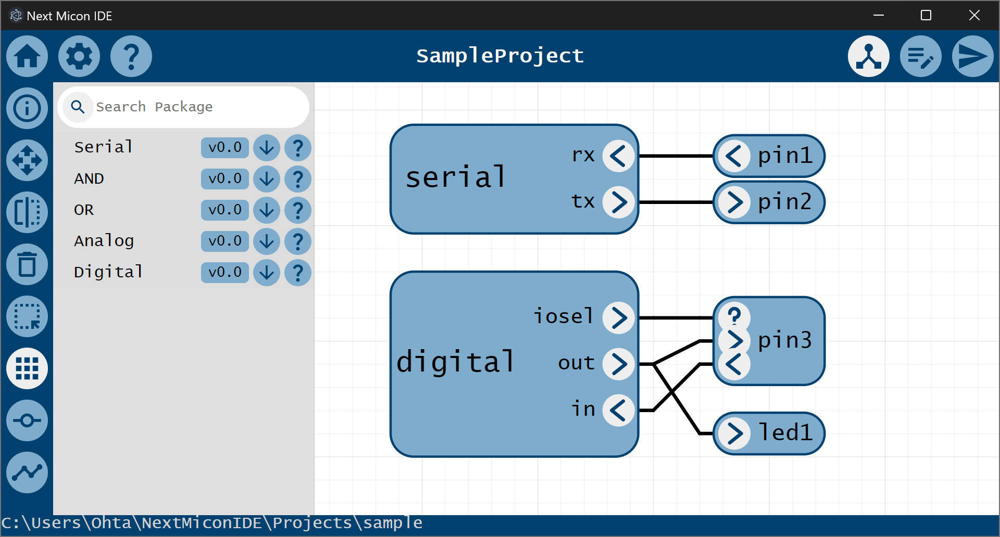
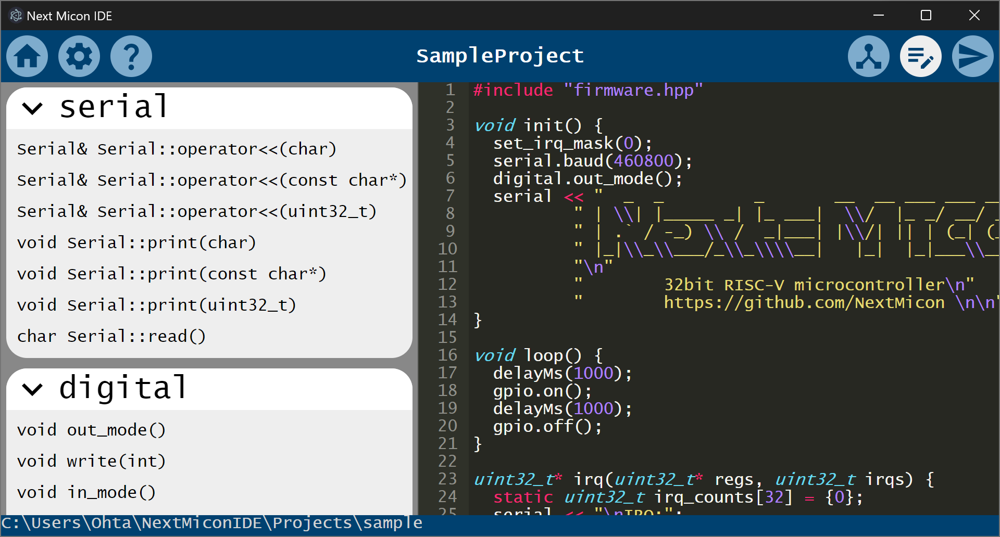

# NextMicon : 🔰 FPGA paltform for Maker

NextMicon を使えば FPGA を使った電子工作が手軽にできます！

## [🛠️ Next Micon IDE](https://github.com/NextMicon/NextMiconIDE)

## [🍒 Next Micon Cherry](https://github.com/NextMicon/NextMiconCherry)

Next Micon Cherry は、安価なエントリクラスのFPGAボードです。
ATMega328 と同程度のマイコンを作るだけの機能を備えています。

## [🍇 Next Micon Grape](https://github.com/NextMicon/NextMiconGrape)

Next Micon Grape は、Cherry よりも高機能なFPGAボードです。
FPGAらしいハードウェア・アルゴリズムを実装することができます。

## [📟 RK16 : verry simple ISA](https://github.com/kanade-k-1228/RISC-K)

RK16は、とても簡単な構成のISAで、自作CPUの入門として適しています。
アセンブラ、エミュレータが実装されており、簡単に開発を始めることができます。
また、ロジックICでの実装を想定した構成になっており、74シリーズを用いてCPUを実装することもできます。

## Acknowledgments

 - IPA 未踏IT人材発掘・育成事業 ( https://www.ipa.go.jp/jinzai/mitou/it/2023/gaiyou_tn-1.html )
